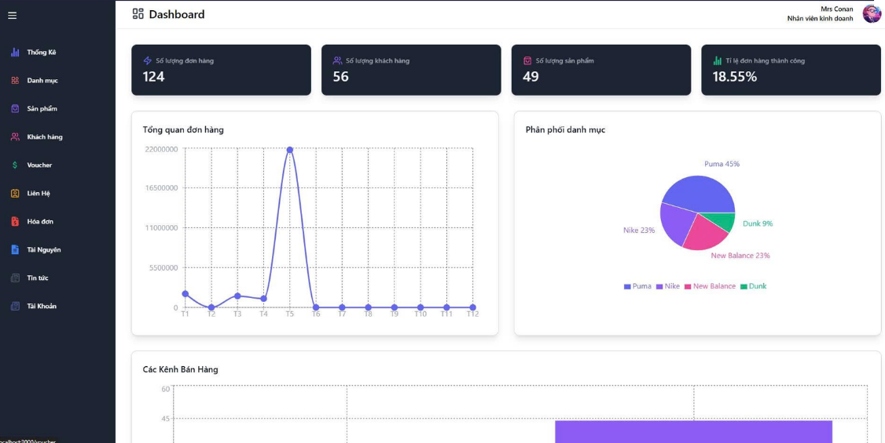
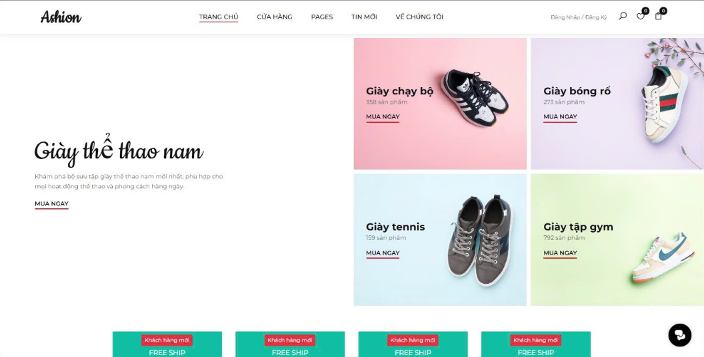
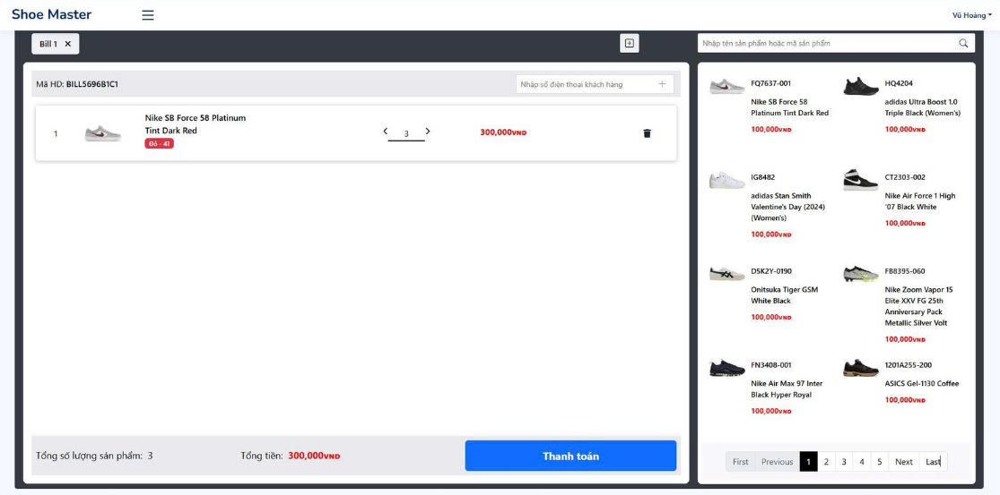

## ✨ Giới thiệu

**Xây dụng website bán giày nam ShoeMaster** là hệ thống bán hàng bao gồm các chức năng:

* Hệ thống quản lý của Admin
* Hệ thống bán hàng online
* Hệ thống bán hàng offline
* Tích hợp thanh toán VNPAY

---

## 🖼 Hình ảnh giao diện

### Trang quản trị


### Bán hàng online


### Bán hàng offline


---

## 📅 Stack công nghệ

* **Backend**: ASP.NET Core (.NET 8)
* **Frontend**: Razor Pages (MVC), React (trong thư mục `Fe/`)
* **ORM**: Entity Framework Core + Dapper
* **Database**: SQL Server
* **Authentication**: JWT + Session
* **Khác**: AutoMapper, FluentValidation, Hangfire

---

## 🔧 Cách chạy project

1. Cài đặt .NET 8 SDK
2. Khởi tạo DB: tại project `Project.DbManagement`

```bash
Update-Database
```

3. Cấu hình chuỗi kết nối trong `appsettings.json`
4. Run project `Project.AdminSell` hoặc `Project.Api`

---

## 📦 Kiến trúc project

```
Solution Root
|
|-- Project.AdminSell/     # Giao diện Admin ASP.NET MVC
|-- Project.Api/           # Web API cho client (mobile/web)
|-- Project.Business/      # Xử lý nghiệp vụ
|-- Project.Common/        # Hằng số, tiện ích, base class
|-- Project.DbManagement/  # EF DbContext, entity models
|-- Project.MVC/           # Web MVC (khách hàng hoặc admin)
|-- Fe/                    # Frontend Angular (khách hàng)
```

## 📊 Thiết kế cơ sở dữ liệu (Entities chính)

* `Products`, `Categories`, `ProductCategoriesRelations`
* `Users`, `Customers`
* `Bills`, `BillDetails`
* `Carts`, `CartDetails`
* `Vouchers`, `VoucherDetails`, `VoucherProducts`, `VoucherUsers`
* `PaymentMethods`, `ImageFiles`, `Comments`, `ContentBases`

---

## 🖐️ Triển khai

* Dễ dàng triển khai lên Azure / IIS / Container
* Tích hợp VNPAY (cần khai báo key sandbox trong config)

---

## 📄 License

Project này được xây dựng như một đề tài khoán thực hành. Vui lòng liên hệ tác giả trước khi tái sử dụng.
